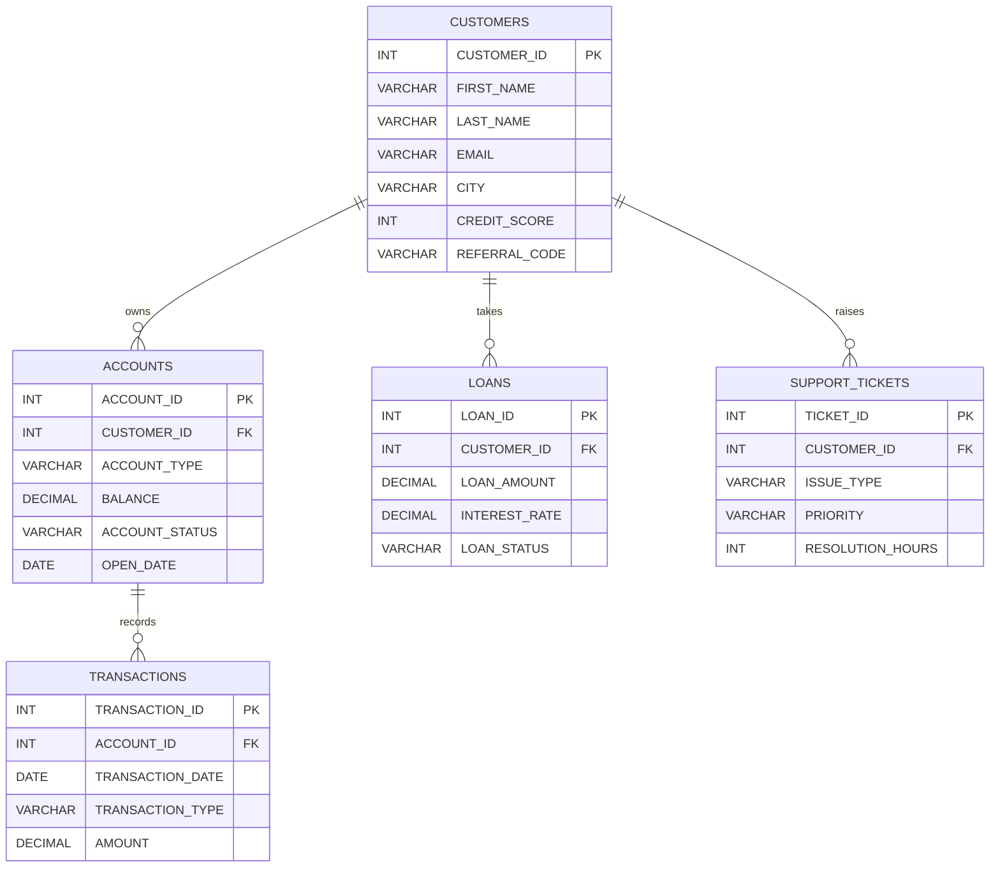

# ER Diagram

```mermaid
erDiagram
    CUSTOMERS {
        INT CUSTOMER_ID PK
        VARCHAR FIRST_NAME
        VARCHAR LAST_NAME
        VARCHAR EMAIL
        VARCHAR CITY
        INT CREDIT_SCORE
        VARCHAR REFERRAL_CODE
    }

    ACCOUNTS {
        INT ACCOUNT_ID PK
        INT CUSTOMER_ID FK
        VARCHAR ACCOUNT_TYPE
        DECIMAL BALANCE
        VARCHAR ACCOUNT_STATUS
        DATE OPEN_DATE
    }

    LOANS {
        INT LOAN_ID PK
        INT CUSTOMER_ID FK
        DECIMAL LOAN_AMOUNT
        DECIMAL INTEREST_RATE
        VARCHAR LOAN_STATUS
    }

    TRANSACTIONS {
        INT TRANSACTION_ID PK
        INT ACCOUNT_ID FK
        DATE TRANSACTION_DATE
        VARCHAR TRANSACTION_TYPE
        DECIMAL AMOUNT
    }

    SUPPORT_TICKETS {
        INT TICKET_ID PK
        INT CUSTOMER_ID FK
        VARCHAR ISSUE_TYPE
        VARCHAR PRIORITY
        INT RESOLUTION_HOURS
    }

    CUSTOMERS ||--o{ ACCOUNTS : owns
    CUSTOMERS ||--o{ LOANS : takes
    CUSTOMERS ||--o{ SUPPORT_TICKETS : raises
    ACCOUNTS ||--o{ TRANSACTIONS : records
```
